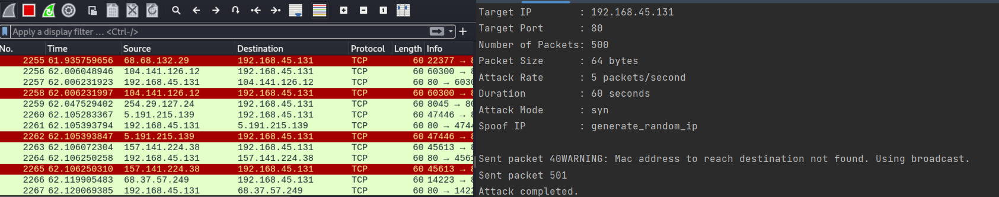

# DosExecutor
DosExecutor is a Python-based testing tool for Denial of Service (DoS). It enables security experts and researchers to simulate various types of DoS attacks in order to analyse the resilience of networks, systems, and applications against prospective cyber threats.





## Advantages

DoSinator offers SYN Flood, UDP Flood, and ICMP Flood attack modes, allowing you to mimic several sorts of DoS attacks.
- **Adjustable Parameters**: Change the packet size, attack rate, and duration to fine-tune the attack's intensity and length.
- **IP Spoofing**: Enable IP spoofing to hide the attack's source IP address and increase anonymity.
- **Multithreaded Packet Sending**: Use many threads to send packets at the same time, increasing attack speed and efficiency.


## Requirements

- Python 3.x
- scapy
- argparse

## Installation

1. Clone the repository:

   ```shell
   git clone https://github.com/Sandeep060/DosExecutor.git
   ```

2. Navigate to the project directory:

   ```shell
   cd DosExecutor
   ```

3. Install the required dependencies:

   ```shell
   pip install -r requirements.txt
   ```

## Usage

```shell
usage: dosinator.py [-h] -t TARGET -p PORT [-np NUM_PACKETS] [-ps PACKET_SIZE]
                   [-ar ATTACK_RATE] [-d DURATION] [-am {syn,udp,icmp,http,dns}]
                   [-sp SPOOF_IP] [--data DATA]

optional arguments:
  -h, --help            Show this help message and exit.
  -t TARGET, --target TARGET
                        Target IP address.
  -p PORT, --port PORT  Target port number.
  -np NUM_PACKETS, --num_packets NUM_PACKETS
                        Number of packets to send (default: 500).
  -ps PACKET_SIZE, --packet_size PACKET_SIZE
                        Packet size in bytes (default: 64).
  -ar ATTACK_RATE, --attack_rate ATTACK_RATE
                        Attack rate in packets per second (default: 10).
  -d DURATION, --duration DURATION
                        Duration of the attack in seconds.
  -am {syn,udp,icmp,http,dns}, --attack-mode {syn,udp,icmp,http,dns}
                        Attack mode (default: syn).
  -sp SPOOF_IP, --spoof-ip SPOOF_IP
                        Spoof IP address.
  --data DATA           Custom data string to send.
```

- `target_ip`: IP address of the target system.
- `target_port`: Port number of the target service.
- `num_packets`: Number of packets to send (default: 500).
- `packet_size`: Size of each packet in bytes (default: 64).
- `attack_rate`: Attack rate in packets/second (default: 10).
- `duration`: Duration of the attack in seconds.
- `attack_mode`: Attack mode: syn, udp, icmp, http (default: syn).
- `spoof_ip`: Spoof IP address (default: None).
- `data`: Custom data string to send.

## Disclaimer

It is prohibited to use the Dosinator tool to assault targets without first obtaining mutual consent. It is the end user's obligation to follow all applicable local, state, and federal laws. The author accepts no liability and is not responsible for any abuse or harm caused by this programme.

By using Dosinator, you promise to use it solely for educational and ethical objectives. The author is not liable for any actions or repercussions stemming from the misuse of this product.

Please confirm that you have the proper permissions before conducting any type of testing on a target network. Use this tool at your own risk
